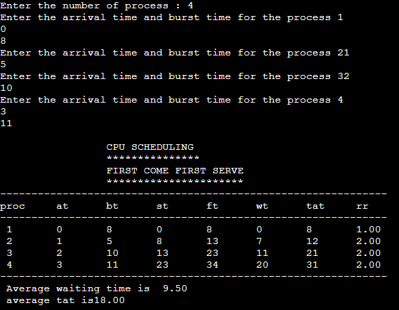
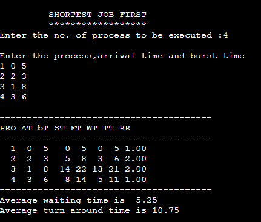

# EX.5-IMPLEMENTATION-OF-CPU-SCHEDULING-ALGORITHMS

### AIM: 
To implement First-Come-First-Serve (FCFS) Scheduling

### ALGORITHM:
1. Start the process
2. Get the number of processes to be inserted
3. Get the value for burst time of each process from the user
4. Having allocated the burst time(bt) for individual processes , Start with the first
process from its initial position let other process to be in queue
5. Calculate the waiting time(wt) and turnaround time(tat) as
6. Wt(pi) = wt(pi-1) + tat(pi-1) (i.e. wt of current process = wt of previous process + tat of
previous process)
7. tat(pi) = wt(pi) + bt(pi) (i.e. tat of current process = wt of current process + bt of
current process)
8. Calculate the total and average waiting time and turnaround time
9. Display the values
10. Stop the process

### PROGRAM:
```
#include<stdio.h>
int main()
{
int bt[20],p[20],wt[20],tat[20],i,j,n,total=0,pos,temp; float
avg_wt,avg_tat;
printf("Enter number of process:");
scanf("%d",&n);
printf("\nEnter Burst Time:\n");
for(i=0;i<n;i++)
{
printf("p % d:",i+1);
scanf("%d",&bt[i]);
p[i]=i+1; //contains process number
}
wt[0]=0; //waiting time for first process will be zero
//calculate waiting time
for(i=1;i<n;i++)
{
wt[i]=0;
for(j=0;j<i;j++)
wt[i]+=bt[j];
total+=wt[i];
}
avg_wt=(float)total/n; //average waiting time
total=0;
printf("\nProcess\t Burst Time \tWaiting Time\tTurnaround Time");
for(i=0;i<n;i++)
{
tat[i]=bt[i]+wt[i]; //calculate turnaround time
total+=tat[i];
printf("\np%d\t\t %d\t\t %d\t\t\t%d",p[i],bt[i],wt[i],tat[i]);
}
avg_tat=(float)total/n; //average turnaround time
printf("\n\nAverage Waiting Time=%f",avg_wt);
printf("\nAverage Turnaround Time=%f\n",avg_tat);
}
```

### OUTPUT:


### RESULT: 
First-Come-First-Serve Scheduling is implemented successfully.


### AIM: 
To implement Shortest Job First (SJF) Preemptive Scheduling

### ALGORITHM:
1. Start the process
2. Get the number of processes to be inserted
3. Sort the processes according to the burst tiine and allocate the one with shortest burst to
execute first
4. If two process have same burst length then FCFS scheduling algorithm is used
5. Calculate the total and average waiting time and turn around time
6. Display the values
7. Stop the process

### PROGRAM:
```
#include<stdio.h>
int main()
{
int bt[20],p[20],wt[20],tat[20],i,j,n,total=0,pos,temp; float
avg_wt,avg_tat;
printf("Enter number of process:");
scanf("%d",&n);
printf("\nEnter Burst Time:\n");
for(i=0;i<n;i++)
{
printf("p%d:",i+1);
scanf("%d",&bt[i]);
p[i]=i+1; //contains process number
}
//sorting burst time in ascending order using selection sort
for(i=0;i<n;i++)
{
pos=i;
for(j=i+1;j<n;j++)
{
if(bt[j]<bt[pos])
pos=j;
}
temp=bt[i];
bt[i]=bt[pos];
bt[pos]=temp;
temp=p[i];
p[i]=p[pos];
p[pos]=temp;
}
wt[0]=0; //waiting time for first process will be zero
//calculate waiting time
for(i=1;i<n;i++)
{
wt[i]=0;
for(j=0;j<i;j++)
wt[i]+=bt[j];
total+=wt[i];
}
avg_wt=(float)total/n; //average waiting time
total=0;
printf("\nProcess\t Burst Time \tWaiting Time\tTurnaround Time");
for(i=0;i<n;i++)
{
tat[i]=bt[i]+wt[i]; //calculate turnaround time
total+=tat[i];
printf("\np%d\t\t %d\t\t %d\t\t\t%d",p[i],bt[i],wt[i],tat[i]);
}
avg_tat=(float)total/n; //average turnaround time
printf("\n\nAverage Waiting Time=%f",avg_wt);
printf("\nAverage Turnaround Time=%f\n",avg_tat);
}
```

### OUTPUT:


### RESULT: 
Shortest Job First (SJF) preemptive scheduling is implemented successfully.


### AIM: 
To implement Shortest Job First (SJF) Non-Preemptive Scheduling

### ALGORITHM:


### PROGRAM:


### OUTPUT:


### RESULT:
Shortest Job First (SJF) Non-preemptive scheduling is implemented successfully.

### AIM: 
To implement Round Robin (RR) Scheduling

### ALGORITHM:
1. Start the process
2. Get the number of elements to be inserted
3. Get the value for burst time for individual processes
4. Get the value for time quantum
5. Make the CPU scheduler go around the ready queue allocating CPU to each process
for the time interval specified
6. Make the CPU scheduler pick the first process and set time to interrupt after quantum.
And after it's expiry dispatch the process
7. If the process has burst time less than the time quantum then the process is released by
the CPU
8. If the process has burst time greater than time quantum then it is interrupted by the OS
and the process is put to the tail of ready queue and the schedule selects next
process from head of the queue
9. Calculate the total and average waiting time and turnaround time
10. Display the results

### PROGRAM:
```
#include<stdio.h>
main()
{
int st[10],bt[10],wt[10],tat[10],n,tq; int
i,count=0,swt=0,stat=0,temp,sq=0;
float awt,atat;
printf("enter the number of processes");
scanf("%d",&n);
printf("enter the burst time of each process /n");
for(i=0;i<n;i++)
{
printf(("p%d",i+1);
scanf("%d",&bt[i]);
st[i]=bt[i];
}
printf("enter the time quantum");
scanf("%d",&tq);
while(1)
{
for(i=0,count=0;i<n;i++)
{
temp=tq;
if(st[i]==0)
{
count++;
continue;
}
if(st[i]>tq)
st[i]=st[i]-tq;
else
if(st[i]>=0)
{
temp=st[i];
st[i]=0;
}
sq=sq+temp;
tat[i]=sq;
}
if(n==count)
break;
}
for(i=0;i<n;i++)
{
wt[i]=tat[i]-bt[i];
swt=swt+wt[i];
stat=stat+tat[i];
}
awt=(float)swt/n;
atat=(float)stat/n;
printf("process no\t burst time\t waiting time\t turnaround time\n");
for(i=0;i<n;i++)
printf("%d\t\t %d\t\t %d\t\t %d\n",i+1,bt[i],wt[i],tat[i]); printf("avg
wt time=%f,avg turn around time=%f",awt,atat);
}
```

### OUTPUT:


### RESULT: 
Round Robin (RR) Scheduling is implemented successfully.


### AIM: 
To implement Priority Preemptive Scheduling

### ALGORITHM:
1.Input process information for n processes and initialize variables.
2.Implement priority-based scheduling to determine process execution order.
3.Calculate waiting times and turnaround times for each process.
4.Compute the average waiting time and average turnaround time.
5.Display the results, including process details and averages

### PROGRAM:
```
#include<stdio.h>
struct process
{
    int WT,AT,BT,TAT,PT;
};

struct process a[10];

int main()
{
    int n,temp[10],t,count=0,short_p;
    float total_WT=0,total_TAT=0,Avg_WT,Avg_TAT;
    printf("Enter the number of the process\n");
    scanf("%d",&n);
    printf("Enter the arrival time , burst time and priority of the process\n");
    printf("AT BT PT\n");
    for(int i=0;i<n;i++)
    {
        scanf("%d%d%d",&a[i].AT,&a[i].BT,&a[i].PT);
        
        // copying the burst time in
        // a temp array fot futher use
        temp[i]=a[i].BT;
    }
    
    // we initialize the burst time
    // of a process with maximum 
    a[9].PT=10000;
    
    for(t=0;count!=n;t++)
    {
        short_p=9;
        for(int i=0;i<n;i++)
        {
            if(a[short_p].PT>a[i].PT && a[i].AT<=t && a[i].BT>0)
            {
                short_p=i;
            }
        }
        
        a[short_p].BT=a[short_p].BT-1;
        
        // if any process is completed
        if(a[short_p].BT==0)
        {
            // one process is completed
            // so count increases by 1
            count++;
            a[short_p].WT=t+1-a[short_p].AT-temp[short_p];
            a[short_p].TAT=t+1-a[short_p].AT;
            
            // total calculation
            total_WT=total_WT+a[short_p].WT;
            total_TAT=total_TAT+a[short_p].TAT;
            
        }
    }
    
    Avg_WT=total_WT/n;
    Avg_TAT=total_TAT/n;
    
    // printing of the answer
    printf("ID WT TAT\n");
    for(int i=0;i<n;i++)
    {
        printf("%d %d\t%d\n",i+1,a[i].WT,a[i].TAT);
    }
    
    printf("Avg waiting time of the process  is %f\n",Avg_WT);
    printf("Avg turn around time of the process is %f\n",Avg_TAT);
    
    return 0;
}
```

### OUTPUT:


### RESULT: 
Priority Preemptive scheduling is implemented successfully.


### AIM: 
To implement Priority Non-Preemptive Scheduling

### ALGORITHM:


### PROGRAM:
```

```

### OUTPUT:


### RESULT: 
Priority Non-preemptive scheduling is implemented successfully.

